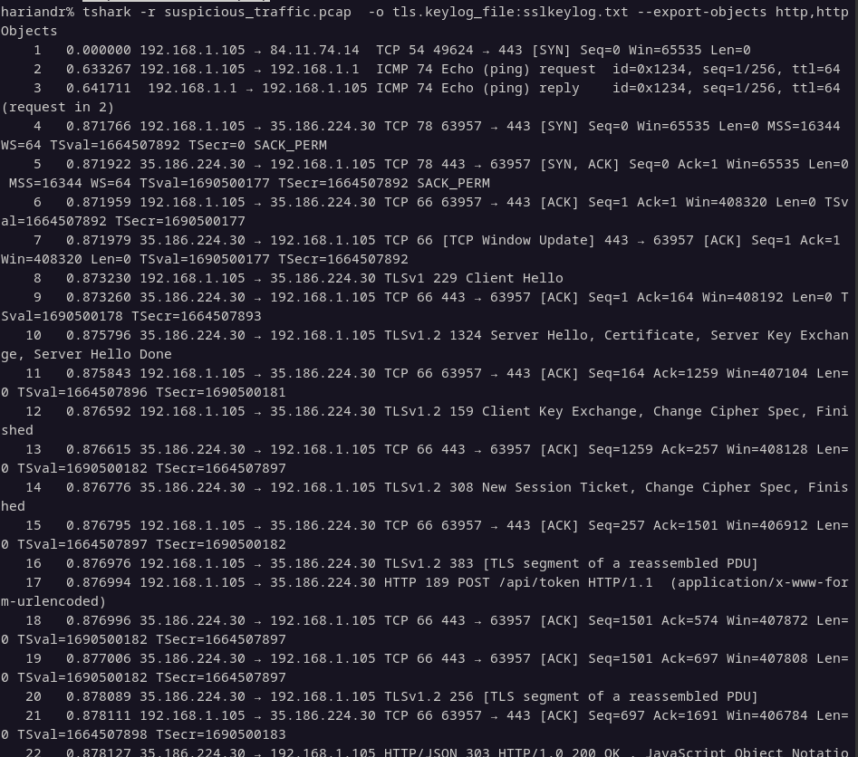
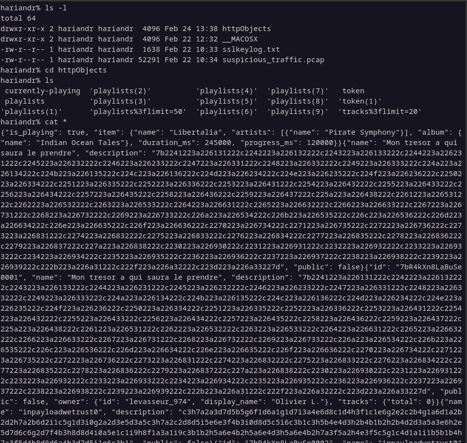
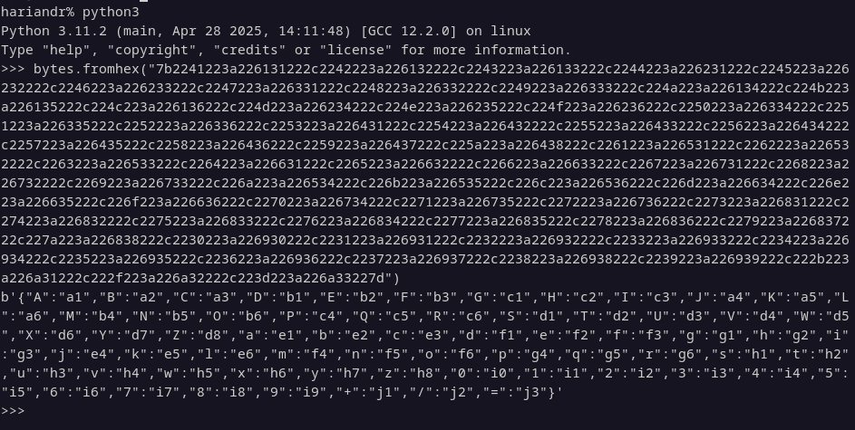
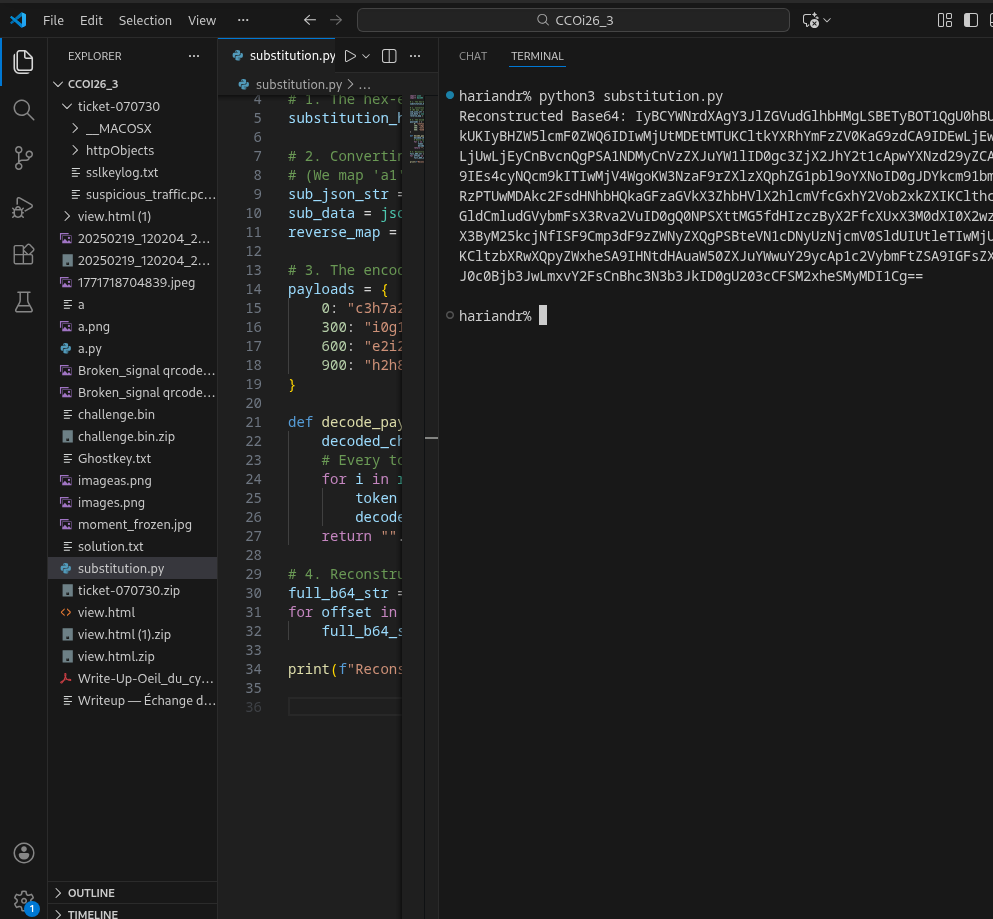
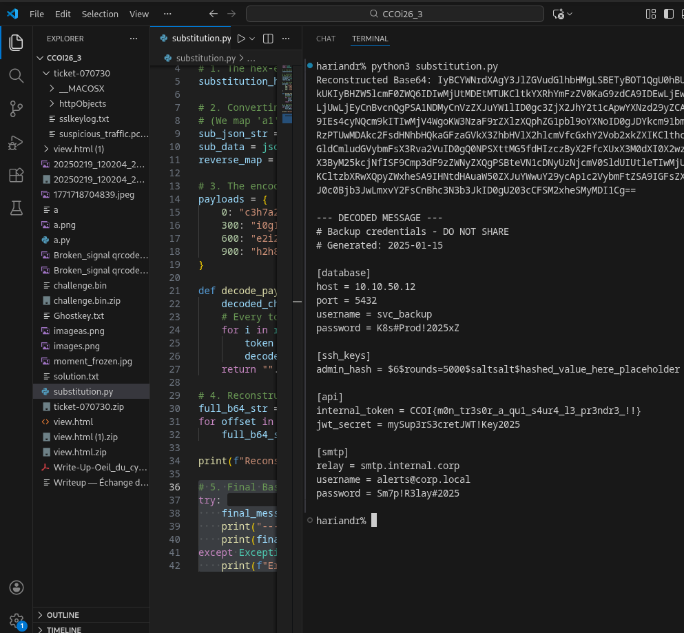

# __CCOI26__ 
## _CMRS-974 - Ticket 07071730_

## Information
**Category:** | **Points:** | **Writeup Author**
--- | --- | ---
Forensics | 400 | Moshimoshi

**Description:** 

> The Specialised Regional Meteorological Centre of Reunion detected abnormal outgoing traffic on a monitoring station during the cyclone. The DLP did not trigger any alerts. An analyst recovered two files from the compromised workstation.
> 
> **Flag format:** CCOI26{...}

## Solution

### Step 1: Traffic Analysis
I was provided with two files: `suspicious_traffic.pcap` and `sslkeylog.txt`. My first step was to analyze the packet capture with **tshark**. To handle the encrypted HTTPS traffic, I provided the SSL keylog file to decrypt the data on the fly and exported the HTTP objects.

### Step 2: Extracting HTTP Objects
Once the parsing was finished, I checked the extracted objects. I moved into the extraction folder and found several files related to an API or web service, including `currently-playing`, `token`, and multiple `playlists` files.

### Step 3: Finding the "Treasure"
By inspecting the contents, I found a JSON object named **"Mon tresor a qui saura le prendre"**. It contained a long hexadecimal string mapped as a "description". Just below, I noticed several other JSON objects named `inpayloadwetrust0`, `inpayloadwetrust300`, `inpayloadwetrust600`, and `inpayloadwetrust900`.

### Step 4: Decoding the Payload
My logic was clear: the first object acted as a substitution dictionary, mapping hexadecimal pairs to plaintext characters, while the "inpayloadwetrust" objects were chunks of the encoded payload. I decided to create a script to decode this logic.

The resulting string appeared to be **Base64**. After decoding it, the flag was finally revealed.

> CCOI26{m0n_tr3s0r_a_qu1_s4ur4_l3_pr3ndr3_!!}
