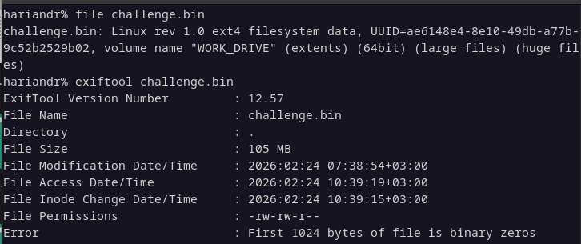
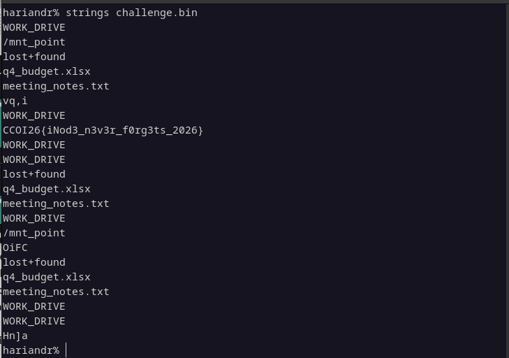

# __CCOI26__ 
## _Follow Format_

## Information
**Category:** | **Points:** | **Writeup Author**
--- | --- | ---
Forensic | 100 | Moshimoshi

**Description:** 

> Our client sent us this image and told us that they deleted a file. Please help them recover it. The file contains confidential information. 
> 
> **Flag format:** CCOI26{S0mething_here}

## Solution

### Initial Analysis
I was provided with a file named `challenge.img`. Since this is a forensic challenge involving a deleted file, my first instinct wasn't to mount the image immediately. Instead, I decided to perform a preliminary analysis using standard command-line tools to see if any low-hanging fruit was available.

I started by running basic commands like `file`, `exiftool`, and `strings` to inspect the file's metadata and content.

### Extracting the Flag
To my surprise, the "deleted" information wasn't heavily obfuscated or deeply buried in the file system layers. By running the `strings` command on the image, I was able to extract all readable text sequences. 

The flag was sitting right there in plain sight within the output.

> CCOI26{iNod3_n3v3r_f0rg3ts_2026}

### Conclusion
The challenge was straightforward; despite the hint about a deleted file (which usually implies using tools like `fls` or `icat`), a simple string carving was enough to recover the data.

