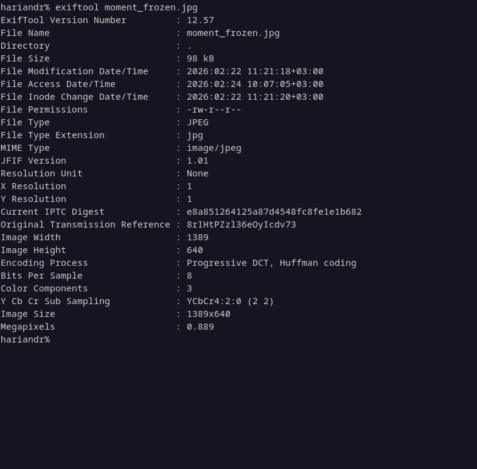
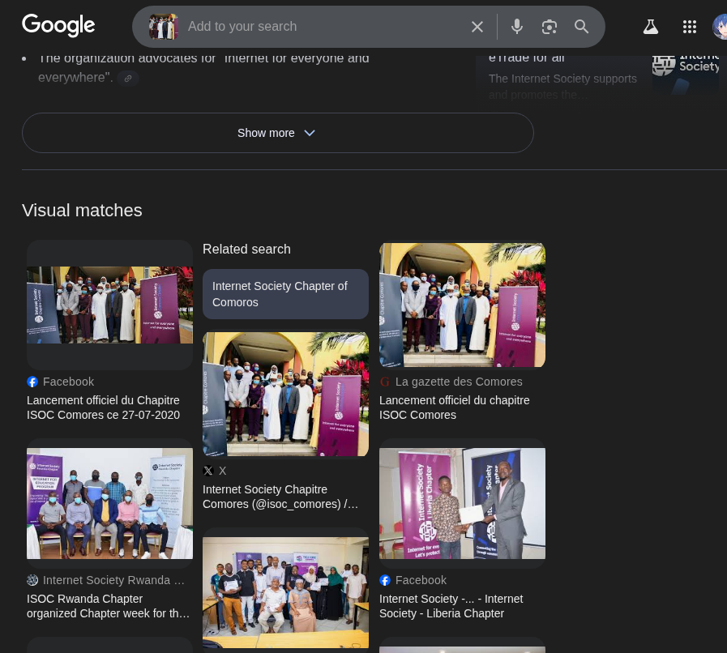
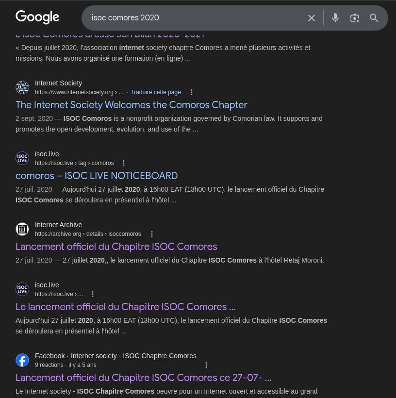
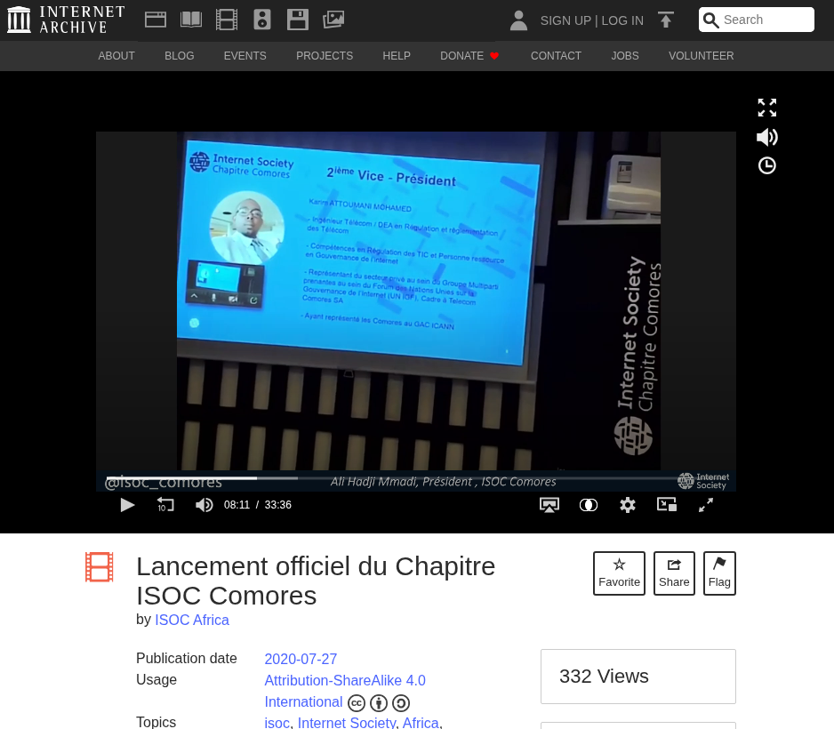

# __CCOI26__ 
## _moment_frozen_

## Information
**Category:** | **Points:** | **Writeup Author**
--- | --- | ---
OSINT | 200 | Moshimoshi

**Description:** 

> A pivotal moment for a safer and more open Internet in the Indian Ocean was captured in this photograph. Identify the following:
> - Abbreviated name of the organization
> - Year of the official launch
> - Exact venue (name + city)
> - First and last name of the 2nd Vice-President at the time
> - Position in the photo (row + position from left, counting from the bottom row)
>
> **Flag Format:** CCOI26{org_year_venue_city_firstname_lastname_rowX_posY}

## Solution

### Step 1: Initial Investigation
I started with a provided image named `moment_frozen.jpg`. My first step was to check for embedded clues using `exiftool` to inspect the metadata.

The metadata didn't reveal anything particularly useful, so I moved on to a visual search strategy.

### Step 2: Reverse Image Search
I performed a reverse image search using **Google Lens**. This was the breakthrough point as it provided almost all the core information needed for the challenge.

The search results identified:
- **Organization:** ISOC (Internet Society) Comoros Chapter.
- **Launch Date:** July 27, 2020 (Year: **2020**).

### Step 3: Finding the Venue and Personnel
To find the exact venue and the specific members, I searched for "ISOC Comores 2020" and located an archived page via **Archive.org**.

From the records, I confirmed the venue: **Hotel Retaj** in **Moroni**. 
The archive also contained a video presentation of the board members. I identified the 2nd Vice-President as **Karim Attoumani Mohamed**.

### Step 4: Locating the Target in the Photo
By comparing the video presentation to the original photograph, I located Karim Attoumani Mohamed. Following the counting constraints (bottom to top, left to right):
- He is in the **bottom row** (Row 1).
- He is the **second person** from the left (Pos 2).

### Final Flag Construction
Applying the formatting rules (lowercase, no accents, underscores for spaces):
- Organization: **isoc**
- Year: **2020**
- Venue/City: **hotel_retaj_moroni**
- Name: **karim_attoumani_mohamed**
- Position: **row1_pos2**

> CCOI26{isoc_2020_hotel_retaj_moroni_karim_attoumani_mohamed_row1_pos2}
