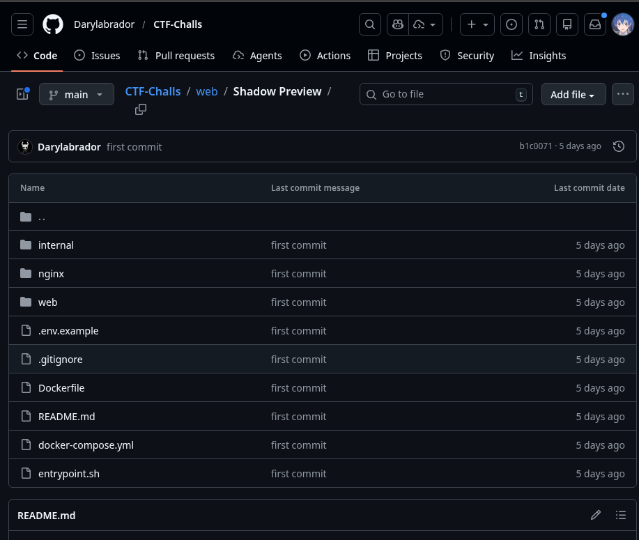
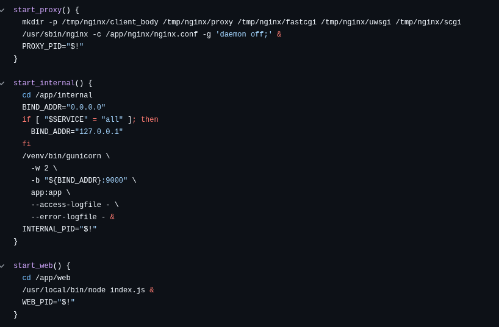
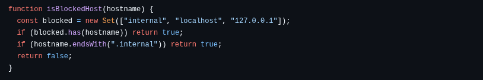
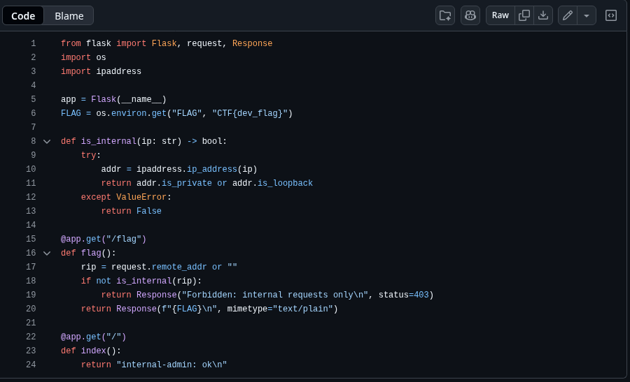
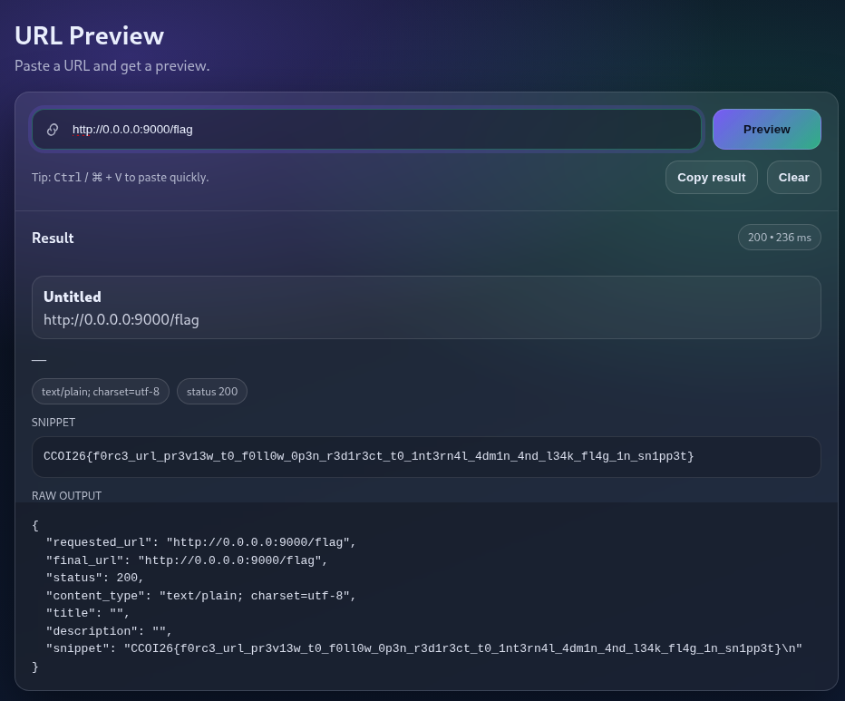

# __CCOI26__ 
## _Shadow Preview_

## Information
**Category:** | **Points:** | **Writeup Author**
--- | --- | ---
Web | 200 | Moshimoshi

**Description:** 

> A rushed release introduced a brand-new “URL Preview” feature to improve the user experience. Soon after, the team noticed unusual behavior in access logs, but no obvious breach could be confirmed. 
> 
> **Mission:** Recover the secret left somewhere in the infrastructure.
> **Flag format:** CCOI26{...}

## Solution

### Step 1: Source Code Analysis
I started by investigating the provided GitHub repository to understand the application's architecture.

While reviewing the `entrypoint.sh` file, I noticed that the infrastructure runs two separate applications. One of them is an internal service bound to the default local IP on port **9000**.

### Step 2: Identifying the Vulnerability
I examined the source code in the web folder and found the "URL Preview" logic. The application implements a filter to prevent requests to `localhost`, `127.0.0.1`, and `internal` to stop Server-Side Request Forgery (SSRF) attacks.

However, looking at the internal application code, I discovered a very interesting `/flag` route that is only accessible from within the network.

### Step 3: Bypassing the Filter
The challenge confirmed my suspicion: it was an SSRF vulnerability. The filter blocked common loopback addresses, but it didn't account for the fact that the internal service was listening on the default interface on port 9000. 

By targeting the internal IP or using a bypass technique to reach `http://0.0.0.0` (the default bind), I was able to trick the "URL Preview" feature into fetching the content of the internal flag route.

### Step 4: Capture the Flag
I sent the crafted request, and the preview engine rendered the internal page, leaking the flag in the process.

> CCOI26{f0rc3_url_pr3v13w_t0_f0ll0w_0p3n_r3d1r3ct_t0_1nt3rn4l_4dm1n_4nd_l34k_fl4g_1n_sn1pp3t}
