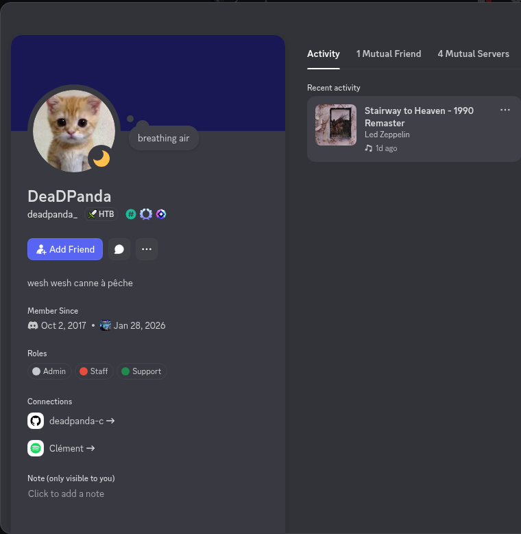
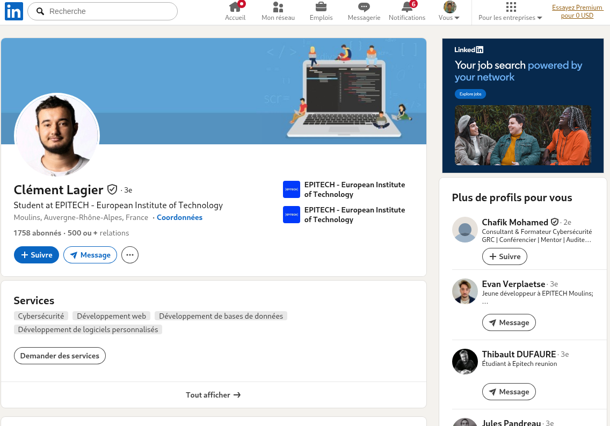
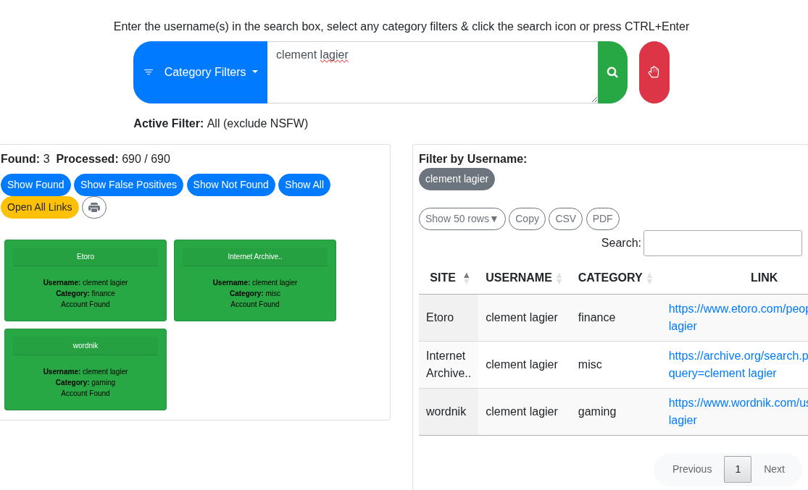
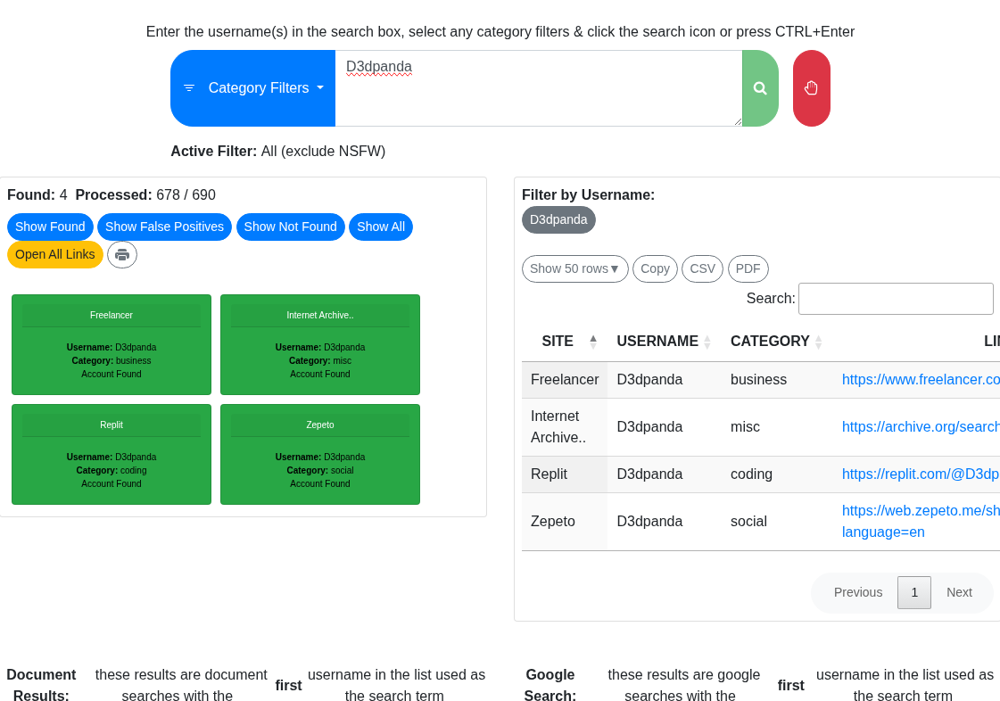
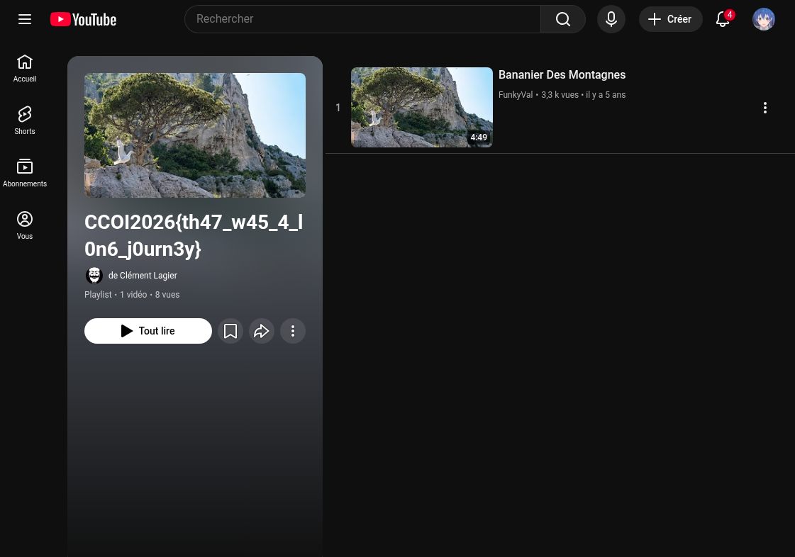

# __CCOI26__ 
## _Who is this guy?_

## Information
**Category:** | **Points:** | **Writeup Author**
--- | --- | ---
OSINT | 200 | Moshimoshi

**Challenge:** 

> Track down information about the user: **d3dpanda**

## Solution

### Step 1: The Discord Connection
I started by recalling an admin from the official Discord server with the username **d3dpanda**. I specifically remembered him because, during the "Welcome" challenge, I had sent him a `/flag` message in DMs (which I quickly deleted afterward).

I went back to check his Discord profile to see if it linked to any other social platforms.

### Step 2: From Linkedin to Real Name
The Discord profile led me straight to his **Linkedin profile**.I managed to find his real name: **Clement Lagier**. 
`Note: It seems he updated his Discord description after the CyberCup, so the linkedin is no longer visible there.`

I initially tried to use [WhatsMyName.app](https://whatsmyname.app) to search for "Clement Lagier". While it returned several hits, none of them seemed relevant to finding a flag.

### Step 3: Pivoting back to the Username
Since the real name search was a dead end, I decided to run the original username **d3dpanda** through [WhatsMyName](https://whatsmyname.app).

This search led me to a **Replit** profile. At first, I didn't see anything interesting on the page and was about to leave, but then I noticed a link pointing to an external website.

### Step 4: Finding the Flag
Following that external link brought me to a playlist. After checking the details, the flag finally appeared.

